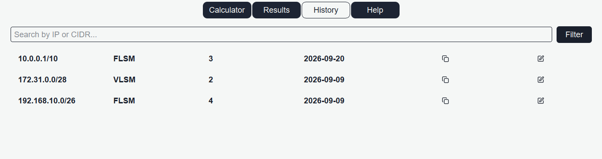

# IP Subnet Calculator

A desktop app built with **PySide6** for calculating subnets using both **FLSM** (Fixed Length Subnet Mask) and **VLSM** (Variable Length Subnet Mask). Enter a base IP address and your requirements, and get the subnet mask, CIDR, address ranges, and host counts for each subnet — no more doing it by hand.

## Screenshots

### Calculator


### Results


### Help


### History


## Features

- **IP class detection** — automatically identifies Class A/B/C (and flags D/E/Loopback as non-subnettable)
- **FLSM calculator** — equal-sized subnets based on how many subnets you need
- **VLSM calculator** — differently-sized subnets based on per-subnet host requirements, with correct sequential address allocation, plus a **wasted addresses** column showing unused space per subnet
- **Live input validation** — invalid octets are flagged in red as you type, with keyboard navigation (press Enter to jump to the next field)
- **Toggle switch** between FLSM and VLSM modes
- **Tabbed interface** — Calculator, Results, History, and Help pages
- **Results table** — a clean view of every subnet: network address, broadcast, first/last usable host, mask, prefix, and wasted addresses (VLSM only)
- **Calculation history** — every calculation is saved to a local SQLite database and viewable in the History tab
- **Copy to clipboard** — right-click any row in Results or History to copy it (tab-separated, pastes cleanly into Excel/Sheets)
- **Edit-in-place** — jump back to the calculator to tweak your input and update the same results table, no duplicate entries
- **Export to PDF** — save your subnet plan as a shareable PDF document
- **Built-in Help page** — a quick reference summary of FLSM/VLSM concepts and formulas

## Tech Stack

- **Python 3**
- **PySide6** (Qt for Python) — UI framework
- **QSS** — custom styling
- **QTextDocument / QPrinter** — PDF export

## Getting Started

### Prerequisites

```bash
pip install PySide6
```

### Running the app

```bash
git clone https://github.com/abbadinsaf/simple-IP-calculator-app
cd <simple IP calculator app>
python main.py
```

## Project Structure

├── main.py # entry point, loads the stylesheet and launches the window
├── mainwindow.py # main window: tab navigation, stacked pages, signal wiring
├── db.py # SQLite connection, schema setup, insert/fetch history
├── ui_helper.py # shared widget factory helpers (buttons, inputs, row copy)
├── style.qss # application stylesheet
└── tabs/
├── calculator.py # calculator page: IP input, FLSM/VLSM logic, validation
├── results.py # results page: table view, edit trigger, PDF export
├── history.py # history page: past calculations from the database
└── help.py # help page: FLSM/VLSM concept summary

## How It Works

**FLSM** borrows a fixed number of bits (based on how many subnets you need) and applies the same new mask to every subnet, walking sequentially through address space in equal-sized blocks.

**VLSM** sorts your host requirements from largest to smallest, then calculates a mask sized specifically for each subnet's needs — allocating addresses sequentially so no space is wasted between subnets, and reports how many addresses each subnet's block leaves unused.

## Roadmap

Ideas under consideration for a future release — nothing below is implemented yet, and no priority order is final:

- **Supernetting / route summarization** — combine multiple subnets into the smallest common supernet, for route aggregation and hierarchical network design
- **Subnet overlap checker** — detect whether two subnets overlap, one contains the other, or are fully separate
- **Wildcard mask calculator** — compute the Cisco ACL/OSPF wildcard mask (bitwise inverse of the subnet mask)
- **Router config export** — generate Cisco IOS-style CLI commands (e.g. `ip address ...`) from calculated subnets
- **IPv6 support** — once the underlying addressing theory (128-bit addresses, hex notation) is covered
- **Network topology visualization** — draw calculated subnets as connected blocks; a lower-priority/portfolio idea, since it's uncommon in comparable tools
- **Dark/light theme toggle** — set aside for now, low priority for this type of app
