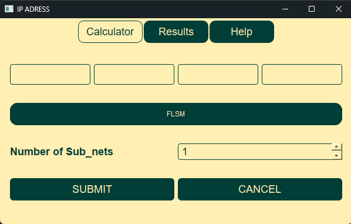
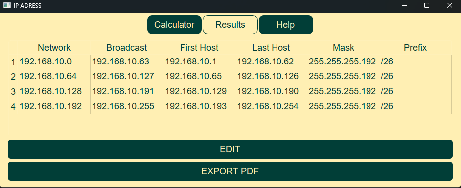
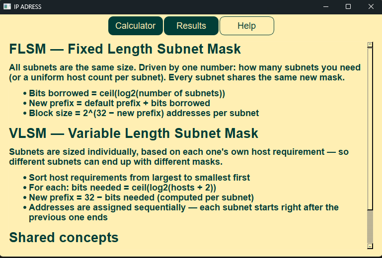

# IP Subnet Calculator

A desktop app built with **PySide6** for calculating subnets using both **FLSM** (Fixed Length Subnet Mask) and **VLSM** (Variable Length Subnet Mask). Enter a base IP address and your requirements, and get the subnet mask, CIDR, address ranges, and host counts for each subnet — no more doing it by hand.

## Screenshots

### Calculator


### Results


### Help


## Features

- **IP class detection** — automatically identifies Class A/B/C (and flags D/E/Loopback as non-subnettable)
- **FLSM calculator** — equal-sized subnets based on how many subnets you need
- **VLSM calculator** — differently-sized subnets based on per-subnet host requirements, with correct sequential address allocation
- **Live input validation** — invalid octets are flagged in red as you type, with keyboard navigation (press Enter to jump to the next field)
- **Toggle switch** between FLSM and VLSM modes
- **Tabbed interface** — Calculator, Results, and Help pages
- **Results table** — a clean, sortable view of every subnet: network address, broadcast, first/last usable host, mask, and prefix
- **Edit-in-place** — jump back to the calculator to tweak your input and update the same results table, no duplicate entries
- **Export to PDF** — save your subnet plan as a shareable PDF document
- **Built-in Help page** — a quick reference summary of FLSM/VLSM concepts and formulas

## Tech Stack

- **Python 3**
- **PySide6** (Qt for Python) — UI framework
- **QSS** — custom styling
- **QTextDocument / QPrinter** — PDF export

## Getting Started

### Prerequisites

```bash
pip install PySide6
```

### Running the app

```bash
git clone https://github.com/abbadinsaf/simple-IP-calculator-app
cd <simple IP calculator app>
python main.py
```

## Project Structure

```
├── main.py            # entry point, loads the stylesheet and launches the window
├── mainwindow.py       # main window: tab navigation, stacked pages, signal wiring
├── calculator.py       # calculator page: IP input, FLSM/VLSM logic, validation
├── results.py          # results page: table view, edit trigger, PDF export
├── help.py             # help page: FLSM/VLSM concept summary
├── ui_helper.py         # shared widget factory helpers (buttons, inputs)
└── style.qss            # application stylesheet
```

## How It Works

**FLSM** borrows a fixed number of bits (based on how many subnets you need) and applies the same new mask to every subnet, walking sequentially through address space in equal-sized blocks.

**VLSM** sorts your host requirements from largest to smallest, then calculates a mask sized specifically for each subnet's needs — allocating addresses sequentially so no space is wasted between subnets.


